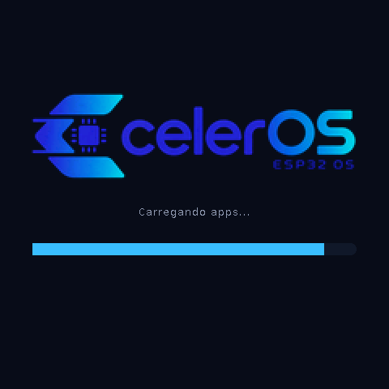
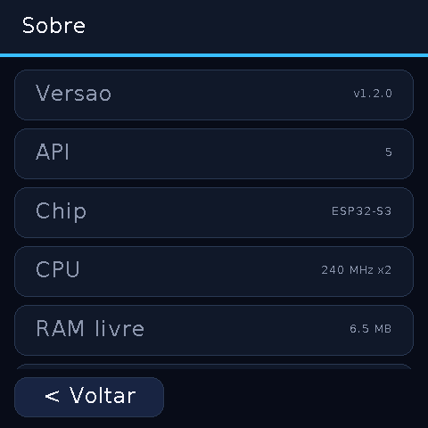
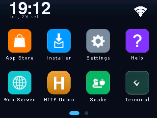
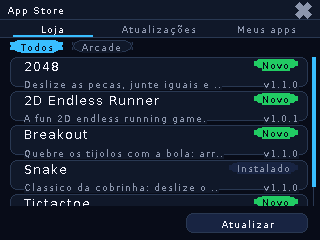
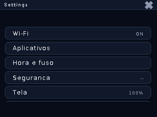
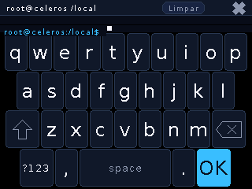
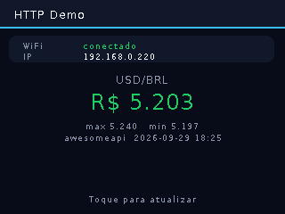
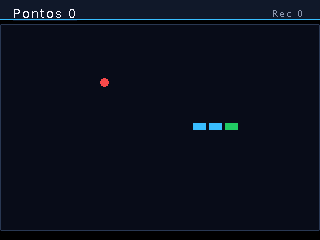
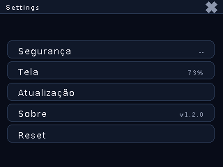
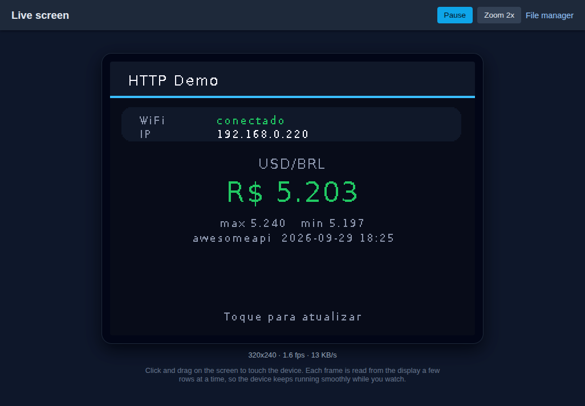

<p align="center">
  
</p>

# CelerOS

**English** | [Português (BR)](README.pt-BR.md)

CelerOS is an open-source, lightweight GUI operating system and JavaScript
app runtime for ESP32 microcontrollers. It turns cheap display boards into a
small "smartwatch-grade" device: an immediate-mode UI on top of LovyanGFX, a
Duktape JS engine running sandboxed apps from flash or SD, an App Store with
over-the-air updates, and a USB companion tool (`celerctl`) for day-to-day
development.

## Screenshots

| Boot splash | Launcher | Terminal (docked keyboard) |
| :---: | :---: | :---: |
|  |  |  |
| **Settings → About** | **Snake** | |
|  |  | |

*Screenshots captured from the real framebuffer of a SmartDisplay 4" via `celerctl screencap`.*

### CYD (2.8" 320x240, no PSRAM)

| Launcher | App Store | Settings |
| :---: | :---: | :---: |
|  |  |  |
| **Terminal (docked keyboard)** | **HTTP Demo** | **Snake** |
|  |  |  |
| **Settings → About** | **Live screen from the browser** | |
|  |  | |

*Captured on a classic ESP32-2432S028R via `celerctl screencap` (API level 8
firmware — Latin-1 accents on screen). The last one is the `/screen` web
mirror: the browser shows the live display and its clicks become touches
(see the [Web interface wiki page](https://github.com/maikramer/CelerOS/wiki/Web-Interface)).*

#### What to expect on the CYD

The CYD runs the same firmware and the same apps, but it is a much smaller
machine than the SmartDisplay (an ESP32 running on one core, ~320 KB of RAM
and no PSRAM, a 2.8" SPI panel and a resistive touch), so the experience is
noticeably simpler:

* **Stretched apps.** JS apps are designed for a 240x320 portrait canvas; on
  the 320x240 landscape glass they are scaled 1.33x wide and 0.75x tall, so
  text and shapes look squashed.
* **Apps can flicker.** There is no RAM for an off-screen frame, so JS apps
  draw straight to the panel (`System.isBuffered()` is `false`). The system
  UI (launcher, dialogs, app top bar) is composed in two small bands and does
  not flicker, but an app that clears and redraws the whole screen on every
  event will.
* **Slower.** A full-screen redraw is bound by the 40 MHz SPI bus (~31 ms);
  big apps take 1–2 s to compile when they open (Settings, App Store).
* **Tight memory.** An app gets ~220 KB of internal RAM (part of it slower
  IRAM); the practical ceiling is a `main.js` of ~60 KB, and big apps take a
  few seconds to open. Bigger apps are marked "Requer PSRAM" in the store.
* **Resistive touch.** It needs a firmer press and a calibration on first
  boot; targets are small (48 px icons, 20 px top bar). You can also drive
  the screen from the browser with the live mirror.
* **Board hardware still in JS.** The RGB LED on the back, the light sensor
  (auto-brightness) and the speaker connector all work through `System.led`
  / `lightLevel` / `beep`.
* **No SD card** for now (the slot shares the display bus).

## Features

* **JavaScript app runtime** — interactive apps written in ES5 run natively via Duktape (API level 10): canvas-style drawing, touch and coupled on-screen keyboard (`System.keypad*`), file system, HTTP/JSON networking.
* **Immediate-mode UI** — adaptive layout (`main/Display/Layout.h`): the same apps scale from 240x320 up to 480x480, with PNG icons decoded to an RGB565+A4 cache.
* **Pre-installed apps in JS** — Settings, App Store, Installer, Help, Web Server, Terminal, Snake and the demos (HTTP Demo, Touch Test) live in the LittleFS partition; the firmware carries only the core (that shaved ~330 KB off the CYD image).
* **App Store & Installer** — browse and install apps from the [CelerOS Hub](https://os.celer.tec.br) over Wi-Fi, or sideload from the SD card.
* **Over-the-air updates** — firmware updates from the device (Settings → System Updates), from the browser (`/update` upload page), or via `celerctl ota push`. See [tools/README_OTA.md](tools/README_OTA.md).
* **Captive portal Wi-Fi setup** — no credentials stored? The device opens a `CelerOS-Setup-XXXX` access point; you configure Wi-Fi from your phone. Wi-Fi auto-reconnects on router drops.
* **Live screen from the browser** — `/screen` mirrors the display over Wi-Fi (RLE frames served row-block by row-block, so the device keeps running smoothly) and forwards your clicks as touches.
* **Board hardware in JS** — RGB LED (`System.led`), light sensor with auto-brightness (`System.lightLevel`), speaker (`System.beep`), relay lines on the SmartDisplay "Y" SKUs (`System.relay`), servos (`System.gpio.servo`) and robot-board hardware — battery, microphone, capacitive touch pad, NeoPixel (`System.battery`/`micLevel`/`touchPad`/`neopixel`).
* **Celer Link (BLE)** — Bluetooth LE link between nearby CelerOS devices (API 9): put a board on a robot, drive it from another CelerOS app (`CelerLink.scan/connect/send` — the Celer Remote hub app does exactly that). No pairing in v1: toys and prototypes.
* **`celerctl` USB companion** — adb-style tool over the serial link: interactive shell, file push/pull, live logcat, in-place firmware update and screencap. See [tools/README_USBTOOL.md](tools/README_USBTOOL.md).
* **Settings PIN lock** — optional numeric PIN (salted SHA-256, handled natively) protects Settings, with a 60 s unlock session.
* **Web file manager with authentication** — files, text editor and firmware upload over the browser, guarded by HTTP Basic Auth (password shown in the Web Server app or `celerctl info`).
* **File management** — file explorer and text editor over LittleFS and SD card.

## Supported Boards

| SmartDisplay 4" | CYD |
| :---: | :---: |
|  |  |

| Board | SoC | Display | Touch | Notes |
|---|---|---|---|---|
| **SmartDisplay 4"** (Guition ESP32-S3-4848S040) | ESP32-S3-N16R8 | 4" IPS 480x480 RGB (ST7701) | Capacitive GT911 | 16 MB flash / 8 MB PSRAM, microSD (`/sd`), I2S speaker (NS4168 — `System.beep`); "Y" wall-switch SKUs with 1 or 3 relays (`System.relay`) |
| **CYD** (ESP32-2432S028R, "Cheap Yellow Display") | ESP32 | 2.8" ILI9341 240x320 SPI | Resistive XPT2046 | Classic witnessmenow variant (TFT on HSPI 14/13/12, touch on dedicated pins, backlight GPIO21); RGB LED, light sensor and speaker (GPIO26) in JS; SD slot off for now; touch calibration on first boot |
| **CYD-VSPI** (untested variant) | ESP32 | 2.8" ILI9341 240x320 SPI | Resistive XPT2046 | Legacy pinout (TFT on VSPI 18/23/19, shared touch bus, backlight GPIO22) kept for boards wired that way — **never tested on hardware**; build with `-DCELEROS_BOARD=cyd-vspi` |

Board definitions live in `boards/<board>/` (sdkconfig defaults) and
`main/Boards/<board>/` (pin map and display driver). Select the target with
`-DCELEROS_BOARD=smartdisplay|cyd`. The UI is resolution-adaptive, so adding
a panel is mostly a new board profile.

## Building & Flashing

CelerOS 1.2+ is plain **ESP-IDF 6.1** (no Arduino/PlatformIO layer).

```bash
git clone https://github.com/maikramer/CelerOS.git && cd CelerOS
git submodule update --init          # LovyanGFX
source ~/esp/v6.1/esp-idf/export.sh  # ESP-IDF v6.1

# SmartDisplay 4" (ESP32-S3)
idf.py -B build -DSDKCONFIG=build/sdkconfig \
  -DSDKCONFIG_DEFAULTS="sdkconfig.defaults;boards/smartdisplay/sdkconfig.defaults" \
  -DCELEROS_BOARD=smartdisplay set-target esp32s3
idf.py -B build build flash -p /dev/ttyUSB0 monitor

# CYD (classic ESP32)
idf.py -B build-cyd -DSDKCONFIG=build-cyd/sdkconfig \
  -DSDKCONFIG_DEFAULTS="sdkconfig.defaults;boards/cyd/sdkconfig.defaults" \
  -DCELEROS_BOARD=cyd set-target esp32
idf.py -B build-cyd build flash -p /dev/ttyUSB0 monitor

# LittleFS image from data/ (system apps + icons + demos)
tools/flash_data.sh smartdisplay /dev/ttyUSB0    # or: cyd <port>

# Local OTA test server
python3 tools/ota_server.py --board smartdisplay
```

Third-party components (ArduinoJson, esp_littlefs, nlohmann/json) are pulled
in by the ESP-IDF component manager; LovyanGFX is a git submodule — clone with
`--recurse-submodules` or run `git submodule update --init`.

### Reproducibility & CI

* **Toolchain pinned**: ESP-IDF **v6.1** (see `.tool-versions`); LovyanGFX is
  pinned to an exact commit by the submodule.
* **CI** ([`.github/workflows/build.yml`](.github/workflows/build.yml)): the
  JS harness and the host C++ tests run on every push/PR, then both board
  firmwares build in the official ESP-IDF container and are uploaded as
  artifacts. Host tests cover the pure logic extracted to `main/Utils`
  (`g++ -std=c++17 test/cpp/run_tests.cpp`).

## JS Apps & Documentation

* [Wiki](https://github.com/maikramer/CelerOS/wiki) — architecture, build, boards, tools and guides (CI-generated from [`wiki/`](wiki/) in the repo).
* [App Development Guide](Documentation/App_Development_Guide.md) ([em português](Documentation/App_Development_Guide.pt-BR.md)) — how to package a JS app (`app.json`, folder layout, icons).
* [JavaScript API Guide](Documentation/JS_API_Guide.md) ([em português](Documentation/JS_API_Guide.pt-BR.md)) — full reference of the JS runtime and native bindings (API level 10).
* [tools/README_USBTOOL.md](tools/README_USBTOOL.md) ([em português](tools/README_USBTOOL.pt-BR.md)) — `celerctl` command reference and the wire protocol.
* [tools/README_OTA.md](tools/README_OTA.md) ([em português](tools/README_OTA.pt-BR.md)) — OTA manifest scheme (`update.json`) and update channels.
* [components/README.md](components/README.md) — vendored helper components and local patches.

Desktop JS harness for the bundled apps (no hardware needed):

```bash
node test/js_harness/run.js
```

## Roadmap

* More boards (help with a bring-up is welcome — board profiles are small and self-contained; the [SpotPear robot dog](https://github.com/maikramer/CelerOS/wiki/Robot-Dog) is the current one).
* More hardware APIs in the JS runtime (I2C/SPI sensors, deeper power management, Celer Link security/pairing).

## History & Credits

CelerOS started as a fork of [KryonOS](https://github.com/Haris16-code/KryonOS)
by Haris and has since diverged heavily: the Arduino/PlatformIO base was
replaced by ESP-IDF 6.1, the graphics stack moved to LovyanGFX, system apps
moved to JavaScript, and the tooling was rebuilt around `celerctl` and the
CelerOS Hub. Thanks, Haris, for the great starting point!

## License

CelerOS is licensed under the [GNU General Public License v3.0](./LICENSE).
