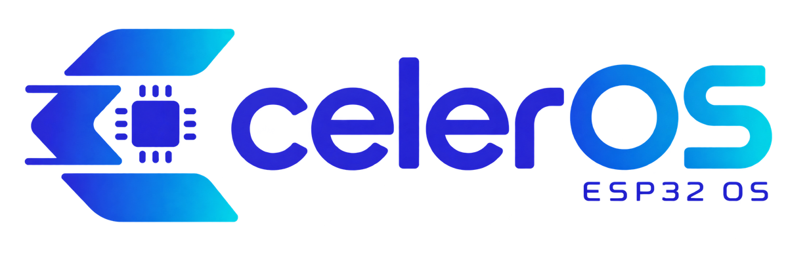
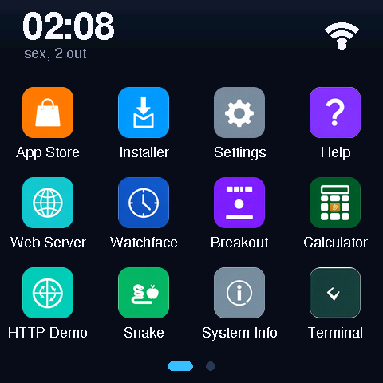
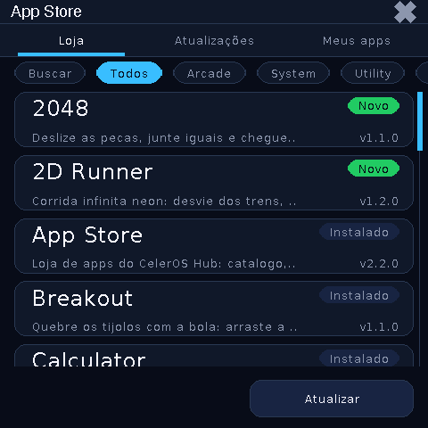
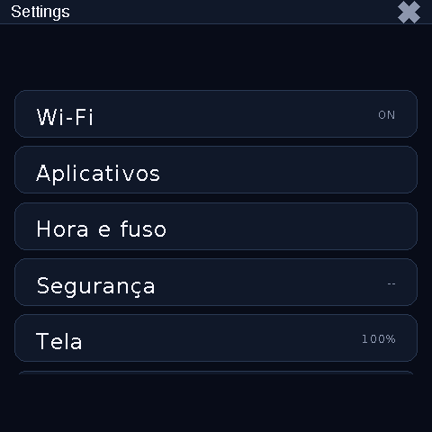
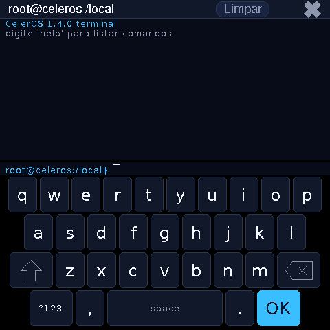
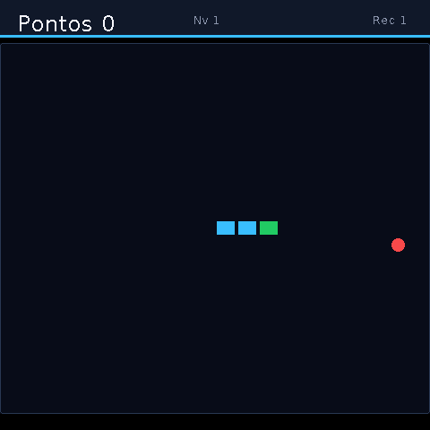
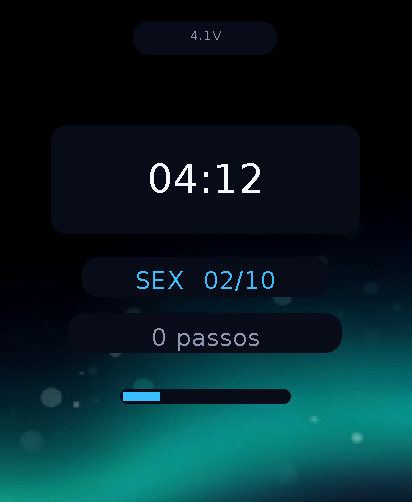
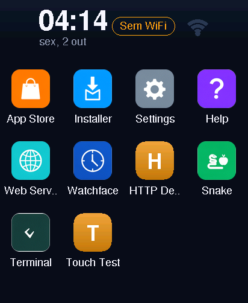
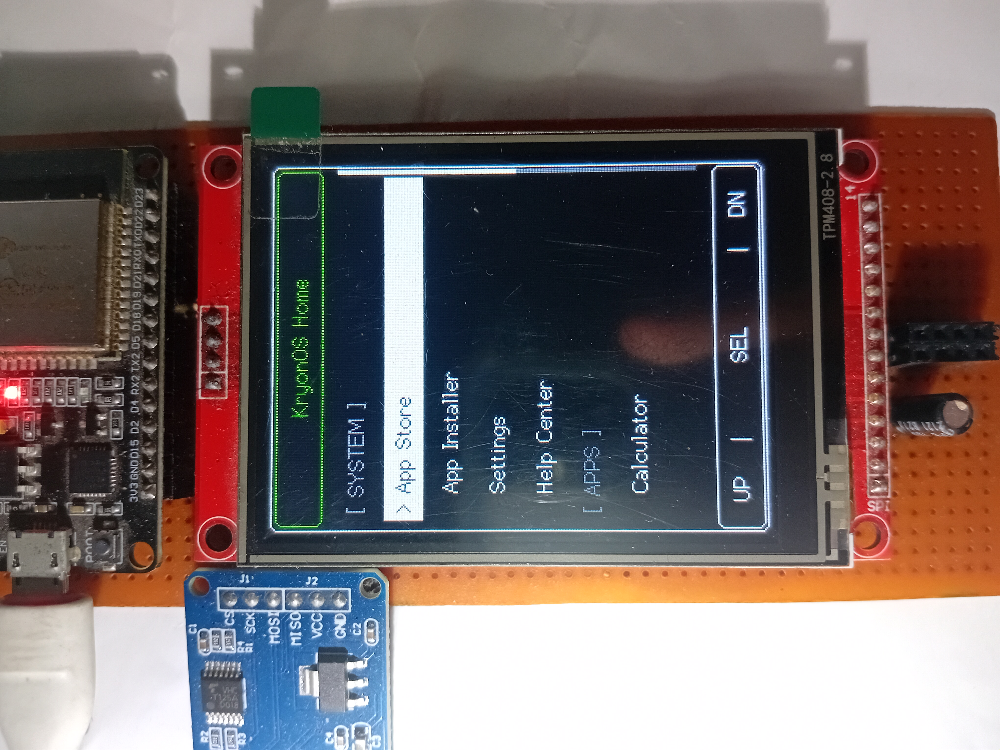

<p align="center">
  
</p>

# CelerOS

[English](README.md) | **Português (BR)**

O CelerOS é um sistema operacional com GUI, leve e de código aberto, com
runtime de apps JavaScript, para microcontroladores ESP32. Ele transforma
placas de display baratas em um pequeno dispositivo "tipo smartwatch": UI
immediate-mode sobre LovyanGFX, engine JS (Duktape) rodando apps de forma
isolada a partir da flash ou do SD, App Store com atualização over-the-air e
uma ferramenta companheira via USB (`celerctl`) para o dia a dia de
desenvolvimento.

## Screenshots

| Launcher | App Store | Settings |
| :---: | :---: | :---: |
|  |  |  |
| **Terminal (teclado acoplado)** | **Snake** | |
|  |  | |

*Capturas do framebuffer real de uma SmartDisplay 4" (firmware 1.4, API nível 13) via `celerctl screencap`.*

### Watch Waveshare AMOLED 2.06

| Watchface (tela inicial) | Launcher |
| :---: | :---: |
|  |  |

*O watch boota direto no mostrador (papel de parede, passos, bateria); swipe pra cima abre o launcher. Mesmo `celerctl screencap`, pelo USB nativo.*

### CYD (2.8" 320x240, sem PSRAM)

A CYD roda o mesmo firmware e os mesmos apps, mas é uma máquina bem menor que
a SmartDisplay (ESP32 com ~320 KB de RAM e sem PSRAM, painel SPI de 2.8" e
toque resistivo), então a experiência é visivelmente mais simples:

* **Apps esticados.** Os apps JS são desenhados para um canvas 240x320 em
  retrato; no vidro 320x240 em paisagem eles são escalados 1,33x na largura e
  0,75x na altura — texto e formas ficam achatados.
* **Apps podem piscar.** Não há RAM para um quadro fora da tela, então os
  apps JS desenham direto no painel (`System.isBuffered()` é `false`). A UI
  do sistema (launcher, diálogos, barra superior dos apps) é composta em duas
  faixas pequenas e não pisca, mas um app que limpa e redesenha a tela
  inteira a cada evento vai piscar.
* **Mais lenta.** Um redesenho de tela cheia é limitado pelo SPI de 40 MHz
  (~31 ms); apps grandes levam 1–2 s compilando ao abrir (Settings, App Store).
* **Memória apertada.** Um app recebe ~220 KB de RAM interna (parte em IRAM,
  mais lenta); o teto prático é um `main.js` de ~60 KB, e apps grandes levam
  alguns segundos para abrir. Apps maiores aparecem como "Requer PSRAM" na
  loja.
* **Toque resistivo.** Pede um toque mais firme e calibração no primeiro
  boot; os alvos são pequenos (ícones de 48 px, barra superior de 20 px).
  Também dá para operar a tela pelo navegador com o espelho ao vivo.
* **Hardware da placa também em JS.** O LED RGB do verso, o sensor de luz
  (brilho automático) e o conector de alto-falante funcionam via
  `System.led` / `lightLevel` / `beep`.
* **Sem cartão SD** por enquanto (o slot divide o barramento do display).

## Funcionalidades

* **Runtime de apps JavaScript** — apps interativos em ES5 rodam nativamente via Duktape (API nível 13): desenho estilo canvas, toque e teclado na tela acoplado (`System.keypad*`), sistema de arquivos e rede HTTP/JSON.
* **UI immediate-mode** — layout adaptativo (`main/Display/Layout.h`): os mesmos apps escalam de 240x320 até 480x480, com ícones PNG decodificados para um cache RGB565+A4.
* **Apps de sistema em JS** — Settings, App Store, Installer, Help, Web Server, Terminal, Snake e as demos (HTTP Demo, Touch Test) moram na partição LittleFS; o firmware carrega só o core (isso cortou ~330 KB da imagem da CYD).
* **App Store e Installer** — navegue e instale apps do [CelerOS Hub](https://os.celer.tec.br) via Wi-Fi, ou instale manualmente a partir do cartão SD.
* **Atualização over-the-air** — firmware direto do aparelho (Settings → System Updates), pelo navegador (página de upload `/update`) ou via `celerctl ota push`. Veja [tools/README_OTA.md](tools/README_OTA.md).
* **Configuração de Wi-Fi por portal cativo** — sem credenciais salvas? O aparelho abre o access point `CelerOS-Setup-XXXX` e você configura o Wi-Fi pelo celular. O Wi-Fi reconecta sozinho se o roteador cair.
* **Tela ao vivo no navegador** — `/screen` espelha o display via Wi-Fi (quadros RLE servidos bloco de linhas por bloco, então o aparelho segue fluido) e repassa seus cliques como toques.
* **Hardware da placa em JS** — LED RGB (`System.led`), sensor de luz com brilho automático (`System.lightLevel`), alto-falante (`System.beep`), linhas de relé nas SKUs "Y" da SmartDisplay (`System.relay`), servos (`System.gpio.servo`) e hardware de placa de robô — bateria, microfone, pad capacitivo, NeoPixel (`System.battery`/`micLevel`/`touchPad`/`neopixel`). O watch acrescenta IMU com pedômetro e raise-to-wake (`Sensors.*`), bateria, RTC que segura a hora sem rede e volume de áudio (`System.setVolume`).
* **Energia de smartwatch** — no watch Waveshare a escada de tela dim depois de alguns segundos, cai para um mostrador always-on com anti burn-in e então vai a deep sleep (acorda por EXT1 nos botões); o aparelho boota direto no mostrador.
* **Celer Link (BLE)** — link Bluetooth LE entre CelerOS próximos (API 9): ponha uma placa num robô e dirija pelo app de outra placa (`CelerLink.scan/connect/send` — o app Celer Remote do hub faz exatamente isso). Sem pareamento na v1: brinquedos e protótipos.
* **Companheiro USB `celerctl`** — ferramenta estilo adb pelo link serial: shell interativo, push/pull de arquivos, logcat ao vivo, atualização de firmware in-place e screencap. Veja [tools/README_USBTOOL.md](tools/README_USBTOOL.md).
* **PIN nas Settings** — PIN numérico opcional (SHA-256 com salt, tratado nativamente) protege as Settings, com sessão de desbloqueio de 60 s.
* **Gerenciador web com autenticação** — arquivos, editor de texto e upload de firmware pelo navegador, protegidos por HTTP Basic Auth (senha exibida no app Web Server ou no `celerctl info`).
* **Gerenciador de arquivos** — explorador e editor de texto no LittleFS e no cartão SD.

## Placas Suportadas

| SmartDisplay 4" | CYD |
| :---: | :---: |
|  |  |

| Placa | SoC | Display | Toque | Observações |
|---|---|---|---|---|
| **SmartDisplay 4"** (Guition ESP32-S3-4848S040) | ESP32-S3-N16R8 | IPS 4" 480x480 RGB (ST7701) | Capacitivo GT911 | 16 MB flash / 8 MB PSRAM, microSD (`/sd`), alto-falante I2S (NS4168 — `System.beep`); SKUs "Y" de parede com 1 ou 3 relés (`System.relay`) |
| **CYD** (ESP32-2432S028R, "Cheap Yellow Display") | ESP32 | ILI9341 2.8" 240x320 SPI | Resistivo XPT2046 | Variante clássica witnessmenow (TFT no HSPI 14/13/12, toque em pinos dedicados, backlight GPIO21); LED RGB, sensor de luz e alto-falante (GPIO26) em JS; slot SD desligado por enquanto; calibração de toque no primeiro boot |
| **CYD-VSPI** (variante não testada) | ESP32 | ILI9341 2.8" 240x320 SPI | Resistivo XPT2046 | Pinout legado (TFT no VSPI 18/23/19, barramento de toque compartilhado, backlight GPIO22) mantido para placas cabladas assim — **nunca testada no hardware**; build com `-DCELEROS_BOARD=cyd-vspi` |
| **Cão robô** (SpotPear ESP32-S3 AI Robot Dog, ZZPET `zzpet-s3`) | ESP32-S3R8 | OLED SH1106 128x64 de 1,3" (cara) | Pad capacitivo (GPIO10) | 16 MB flash / 8 MB PSRAM embutida, 4 servos de perna, microfone + alto-falante I²S, 2x WS2812, bateria no ADC; boota no app **Dog Face** (olhos expressivos, gaits com rampas e keepalive dead-man); controlado por outra placa CelerOS via Celer Link BLE ([wiki](https://github.com/maikramer/CelerOS/wiki/Robo-Cachorro)) |
| **Watch Waveshare AMOLED 2.06** (ESP32-S3-Touch-AMOLED-2.06) | ESP32-S3R8 | AMOLED redondo 2.06" 410x502 QSPI (CO5300) | Capacitivo FT3168 | 32 MB flash / 8 MB PSRAM embutida, PMU AXP2101, RTC PCF85063 + IMU QMI8658 (pedômetro) + codec ES8311 no I²C, microSD; boota no app **Watchface**; escada de tela com always-on display e deep sleep; `celerctl` pelo USB nativo ([wiki](https://github.com/maikramer/CelerOS/wiki/Watch-Waveshare)) |

As definições de placa ficam em `boards/<placa>/` (defaults de sdkconfig) e
`main/Boards/<placa>/` (mapa de pinos e driver de display). Selecione o alvo
com `-DCELEROS_BOARD=<placa>` (os ids da tabela). A UI é adaptativa à resolução, então
adicionar um painel é, na maior parte, um novo perfil de placa.

## Compilando e Gravando

O CelerOS 1.2+ usa **ESP-IDF 6.1 puro** (sem camada Arduino/PlatformIO).

```bash
git clone https://github.com/maikramer/CelerOS.git && cd CelerOS
git submodule update --init          # LovyanGFX
source ~/esp/v6.1/esp-idf/export.sh  # ESP-IDF v6.1 instalado

# SmartDisplay 4" (ESP32-S3)
idf.py -B build -DSDKCONFIG=build/sdkconfig \
  -DSDKCONFIG_DEFAULTS="sdkconfig.defaults;boards/smartdisplay/sdkconfig.defaults" \
  -DCELEROS_BOARD=smartdisplay set-target esp32s3
idf.py -B build build flash -p /dev/ttyUSB0 monitor

# CYD (ESP32 clássico)
idf.py -B build-cyd -DSDKCONFIG=build-cyd/sdkconfig \
  -DSDKCONFIG_DEFAULTS="sdkconfig.defaults;boards/cyd/sdkconfig.defaults" \
  -DCELEROS_BOARD=cyd set-target esp32
idf.py -B build-cyd build flash -p /dev/ttyUSB0 monitor

# Watch Waveshare AMOLED 2.06 (ESP32-S3, USB-Serial/JTAG nativo)
idf.py -B build-watch -DSDKCONFIG=build-watch/sdkconfig \
  -DSDKCONFIG_DEFAULTS="sdkconfig.defaults;boards/waveshare-watch/sdkconfig.defaults" \
  -DCELEROS_BOARD=waveshare-watch set-target esp32s3
idf.py -B build-watch build flash -p /dev/ttyACM0 monitor

# Cão robô SpotPear (ESP32-S3, USB-Serial/JTAG nativo)
idf.py -B build-dog -DSDKCONFIG=build-dog/sdkconfig \
  -DSDKCONFIG_DEFAULTS="sdkconfig.defaults;boards/spotpear-dog/sdkconfig.defaults" \
  -DCELEROS_BOARD=spotpear-dog set-target esp32s3
idf.py -B build-dog build flash -p /dev/ttyACM0 monitor

# Imagem LittleFS de data/ (apps de sistema + ícones + demos)
tools/flash_data.sh smartdisplay /dev/ttyUSB0    # ou: cyd|spotpear-dog|waveshare-watch <porta>

# Servidor OTA local de testes
python3 tools/ota_server.py --board smartdisplay
```

Os componentes de terceiros (ArduinoJson, esp_littlefs, nlohmann/json) são
baixados pelo component manager do ESP-IDF; o LovyanGFX é um submodule —
clonar com `--recurse-submodules` ou rodar `git submodule update --init`.

## Apps JS e Documentação

* [Wiki](https://github.com/maikramer/CelerOS/wiki) — arquitetura, build, placas, ferramentas e guias (gerada por CI a partir de [`wiki/`](wiki/) no repo).
* [Guia de Desenvolvimento de Apps](Documentation/App_Development_Guide.pt-BR.md) ([in English](Documentation/App_Development_Guide.md)) — como empacotar um app JS (`app.json`, estrutura de pastas, ícones).
* [Guia da API JavaScript](Documentation/JS_API_Guide.pt-BR.md) ([in English](Documentation/JS_API_Guide.md)) — referência completa do runtime JS e dos bindings nativos (API nível 13).
* [tools/README_USBTOOL.pt-BR.md](tools/README_USBTOOL.pt-BR.md) ([in English](tools/README_USBTOOL.md)) — referência de comandos do `celerctl` e o protocolo do link.
* [tools/README_OTA.pt-BR.md](tools/README_OTA.pt-BR.md) ([in English](tools/README_OTA.md)) — esquema de manifest OTA (`update.json`) e canais de atualização.
* [components/README.md](components/README.md) — componentes auxiliares vendados e patches locais.

Harness desktop para os apps pré-instalados (sem hardware):

```bash
node test/js_harness/run.js
```

## Roadmap

* Mais placas (ajuda com bring-up é bem-vinda — perfis de placa são pequenos e autocontidos; o [cachorro robô SpotPear](https://github.com/maikramer/CelerOS/wiki/Robo-Cachorro) e o [watch Waveshare AMOLED 2.06](https://github.com/maikramer/CelerOS/wiki/Watch-Waveshare) foram os dois últimos a pousar).
* Mais APIs de hardware no runtime JS (sensores I2C/SPI, sensoriamento assistido por ULP durante o deep sleep, segurança/pareamento do Celer Link).

## História e Créditos

O CelerOS começou como um fork do
[KryonOS](https://github.com/Haris16-code/KryonOS), do Haris, e desde então
divergiu bastante: a base Arduino/PlatformIO foi trocada por ESP-IDF 6.1, o
stack gráfico migrou para o LovyanGFX, os apps de sistema foram para
JavaScript e as ferramentas foram reconstruídas em torno do `celerctl` e do
CelerOS Hub. Obrigado, Haris, pelo excelente ponto de partida!

## Licença

O CelerOS é licenciado sob a [GNU General Public License v3.0](./LICENSE).
